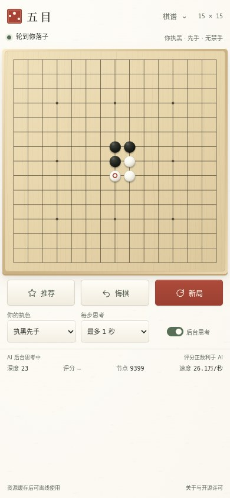
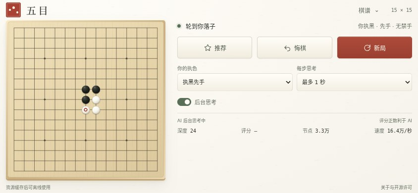

# 现代拟物与日式极简视觉验收

日期：2026-10-04。基于当时云端 main `824e410d26f52f5db897cfc574e78a6e22e367fb`。继续保持棋盘作为移动端主体，原有提示、按钮、选项、控件默认值及可访问标签逐项比对一致；游戏、推荐、棋谱、规则、搜索与后台任务模块未改变。`board-view.js` 只更新四项材质渐变及阴影定义，落点、棋子尺寸、坐标映射和预览 ID 隔离保持原样。

## 视觉变化

- 浅色细密纵向木纹替代原来的横向粗纹，细板边与侧面阴影呈现木板厚度。
- 黑子用墨色光影，白子用温润贝白，降低表面划纹与颗粒的强度。
- 和纸底色、墨色文字、朱红印章和少量朱红操作强调；轻量矩形按钮取消原来被拉伸的按钮贴图。
- 页首“五目”使用本地 Noto Serif SC 500 字体子集，仅包含这两个汉字，1984 字节，随附 SIL OFL 许可证。正文继续使用系统字体，运行页面无第三方字体请求。
- 后台思考仍为原来的 checkbox，更新为视觉开关，支持键盘 Space、可见焦点、减少动态效果偏好和高对比度模式的原生 checkbox 回退。

## 布局与功能

七种视口均保持原有棋盘实际宽度，无横向或纵向溢出，主控件在首屏。

| 视口 | 棋盘宽度（CSS px） |
| --- | ---: |
| 390×844 | 378 |
| 360×640 | 348 |
| 320×568 | 308 |
| 430×932 | 418 |
| 844×390 | 318 |
| 667×375 | 303 |
| 1280×900 | 576 |

- `npm test`：44 项通过，包括棋盘渲染、两个棋盘独立材质 ID、触点映射、胜线、推荐、记录及引擎任务。
- `npm run check`：语法、引擎、权重与补丁 SHA-256 校验通过；`git diff --check` 通过。
- `npm run test:mobile`：9 组真实 Rapfi WASM 检查通过，覆盖四种手机视口、双候选推荐、双击确认、悔棋与自动恢复、棋谱导出/导入/预览/取消、胜线、重开、执色、思考时间、后台思考及错误重试。仅重试场景注入一次初始化错误。
- 专项检查：本地品牌字体加载且无外部材质请求；开关键盘操作、减少动态效果和高对比度回退通过；v10 缓存包含材质与字体，激活时清除旧 v9 缓存；断网刷新后完成真实人类/AI 一轮对弈。

详细数据见 [japanese-style.json](./japanese-style.json)。使用 Chromium 153.0.8010.0 模拟手机与桌面视口，检查环境补充公开 Noto Sans CJK 中文字体；不声称完成真实手机、Safari 或 Edge 验证。没有更改或重跑棋力评估。

