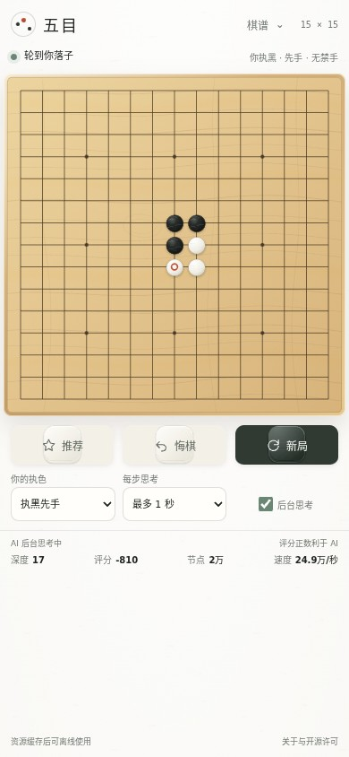
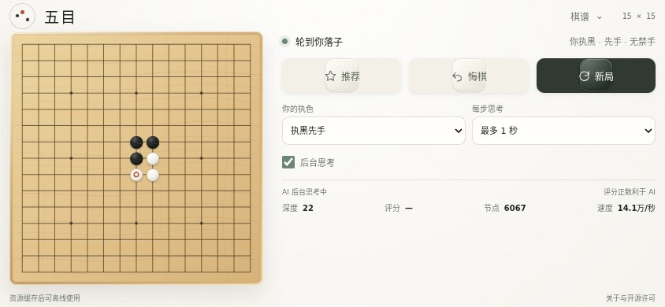

# 棋盘主体布局验证

日期：2026-10-03。以云端主分支 `36808742a774adebd9d33ab430ba94b57e7ec7e7` 为基线，保留已有双落点推荐、棋谱、自动续局、胜线高亮与后台思考。此次调整 HTML 位置、SVG 可视边界与 CSS；游戏、规则、记录及引擎模块未修改。

棋盘脱离包住按钮和信息的外框。竖屏按可用宽度展开，状态与耗时位于上方，操作、设置及搜索信息位于下方；横屏改为左侧棋盘、右侧控件。棋谱入口位于页首，临时通知放在底部，横屏限制在控件侧。所有已有按钮默认可见，原有按状态显示的推荐图例、重试和棋谱菜单保持原来的行为。原有提示、标题、标签和选项文字不变。

主棋盘 viewBox 从 `0 0 620 620` 收紧为 `20 20 580 580`，减少木纹之外的空白，保留外围落点、棋子与胜线；棋谱预览保持原有 viewBox。推荐图例出现时不再缩小棋盘。控件在小屏紧凑排列，主要操作按钮高度 44 px。

## 改版前后实测

相同 Chromium、中文字体、真实 Rapfi WASM 和相同六手局面；尺寸均为 CSS 像素。落点间距包含放大与收紧留白两项影响。

| 视口 | 原棋盘宽度 | 新棋盘宽度 | 落点间距增幅 |
| --- | ---: | ---: | ---: |
| 390×844 | 356 | 378 | 13.5% |
| 360×640 | 267 | 348 | 39.3% |
| 320×568 | 198 | 308 | 66.3% |
| 430×932 | 396 | 418 | 12.8% |
| 844×390 | 132 | 318 | 157.5% |
| 667×375 | 117 | 303 | 176.8% |
| 1280×900 | 514 | 576 | 19.8% |

七种视口的默认布局均无横向或纵向溢出，主要控件全部在首屏。390、320 和两种横屏还验证了推荐图例出现时整页可见，棋盘尺寸不变。完整尺寸及结果见 [mobile-layout.json](./mobile-layout.json)。

## 功能验证

- `npm test`：44 项通过；`npm run check`：语法及原版引擎/补丁校验通过。
- `npm run test:features`：21 组通过，含四种真实 WASM、隔离和非隔离页面、选色、后台分析、悔棋/重开及触屏。
- `npm run test:mobile`：9 组通过，使用真实 WASM 验证 SVG 坐标映射、两次点击确认、推荐不落子、悔棋、保存恢复、棋谱导出与导入预览/取消/确认、胜线、新局、选色、思考时间和后台开关。仅错误重试场景注入一次初始化错误。
- HTML 文字及 ID、title、aria-label、选项和控件默认属性与基线逐项比对一致；应用及引擎模块保持原字节。
- Service Worker 缓存升级到 v9，发布后更新 HTML/CSS。

复现专项交互检查：安装依赖和 Playwright Chromium 后运行 `npm run test:mobile`。已有 Chromium 可通过 `CHROME_PATH` 指定，额外参数用 `CHROME_ARGS` JSON 数组。临时报告与截图在 `.cache/mobile-layout/`。

本次使用 Chromium 153.0.8010.0 的模拟手机视口，没有声称完成真实手机、Safari 或 Edge 验证；没有重跑棋力基准。极矮视口或更大系统字体允许页面自然延长，保留完整提示和棋盘宽度。
