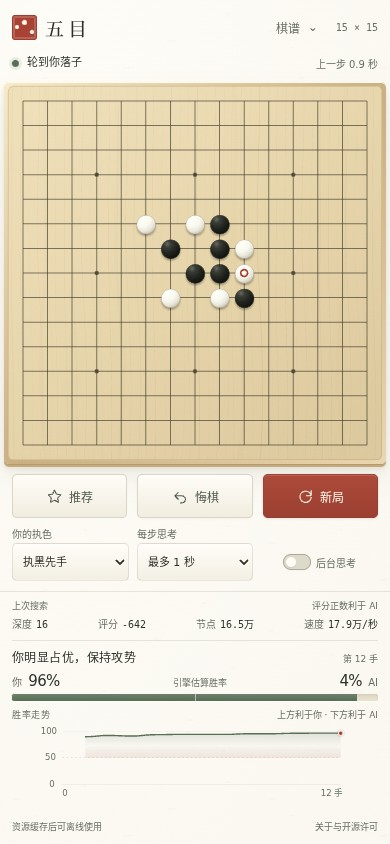
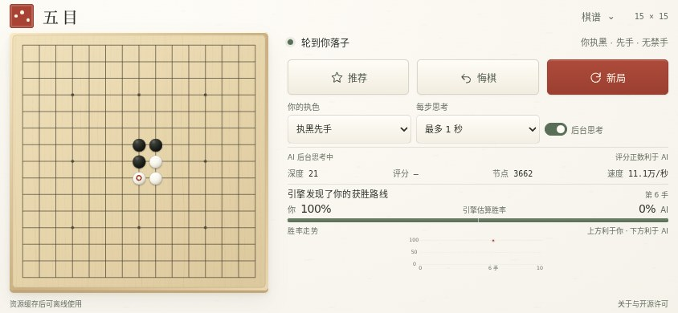

# 局势判断、估算胜率和整局走势

基于 main 的 920589f，新增且只新增这三项。延续和纸底色、墨绿与朱红，不套额外卡片。手机上棋盘及已有按钮尺寸不变，原有提示内容保留。常见长屏与横屏整屏展示；320×568、360×640 等短竖屏保持棋盘和已有控件大小，下方分析自然滚动。

## 数据与同步规则

- 直接使用 Rapfi 250615 回传的 `INFO WINRATE`，不以自行设定的评分公式伪造百分比。数值是引擎模型估算，不是用户实际胜率统计。
- 评分、胜率、深度与首着只在同一条完整 `PV 0 … PV DONE` 帧后成为一个有效评估；推荐的 PV 1 不覆盖主胜率。不完整、越界或取消的评估丢弃。
- 人类视角固定：当前执色、轮到谁搜索、后台思考或前台落子都不改变“你”与“AI”的含义。
- 每个真实局面只占一个走势点；后台继续搜索更新该点，短切片不会覆盖已有更深评估。缺少评估的历史留空，不补假数据。
- AI 的实际落点与完成的主变首着一致时，最终评估沿此着记录为 continuation；人类选择任意落点后重新评估，不搬用上个局面数字。
- 撤销预落子不会改动对局或分析。悔棋截断后续评估并恢复原局面的数据；新分支独立记录。新局、换色及确认导入重置分析，导入预览取消保留分析。
- 请求号、执色和有序棋步共同绑定搜索。取消、悔棋、重开后的旧响应不会写入新局面。
- 分析使用独立本机缓存，续局必须与执色和有序棋步完全匹配，且通过范围、深度、类型和历史长度校验。游戏规则仍由原棋谱重放决定，分析不改变游戏结果。棋谱导出格式不变。
- 胜负结束由棋盘实际结果覆盖估算，平局不显示虚构的 50% 赢棋概率。没有有效评估显示等待，普通估算不以四舍五入冒充确定的 0%/100%。
- 新代码与版本化样式纳入 v12 离线缓存，激活后清除 v11。

Rapfi 的原始定义见 [固定版本的 searchoutput.cpp](https://github.com/dhbloo/rapfi/blob/1be1551ced57e38d53ed58f6d74bf6f8b4bdc230/Rapfi/search/searchoutput.cpp) 和 [config.h](https://github.com/dhbloo/rapfi/blob/1be1551ced57e38d53ed58f6d74bf6f8b4bdc230/Rapfi/config.h)。

## 验证

- `npm test`：55 项通过，新增 PV 配对、主次推荐隔离、视角转换、请求取消、历史截断、分支、续局、损坏缓存、结束与曲线缺口测试。
- `npm run check`：JavaScript 语法与引擎、源补丁 SHA-256 通过。
- `npm run test:analysis`：真实 Rapfi 对局与单线程/多线程确定性协议场景，11 组通过。
- `npm run test:mobile`：真实引擎、四种移动尺寸、双点落子、悔棋续局、棋谱与原有控件，9 组通过。
- `npm run test:features`：四种真实 WASM 变体、完整 WINRATE 帧、后台/前台切换及原有功能回归，21 组通过。
- 七种屏幕：390×844、360×640、320×568、430×932、844×390、667×375、1280×900。棋盘宽度分别保持 378、348、308、418、318、303、576 px，无横向溢出，原控件默认显示。
- 离线刷新后真实落子与胜率正常；v12 模块与样式完整缓存；减少动态和高对比度设置通过。

详见 [机器可读验证记录](./position-analysis.json)。

